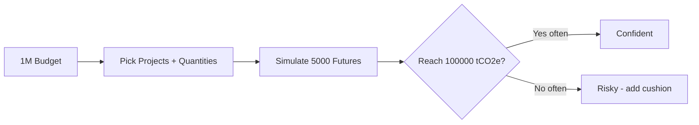
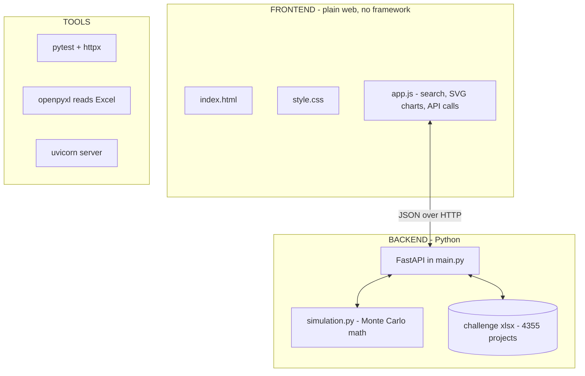
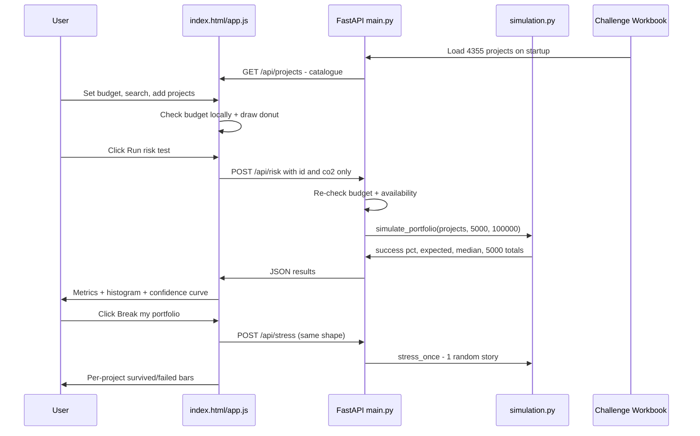
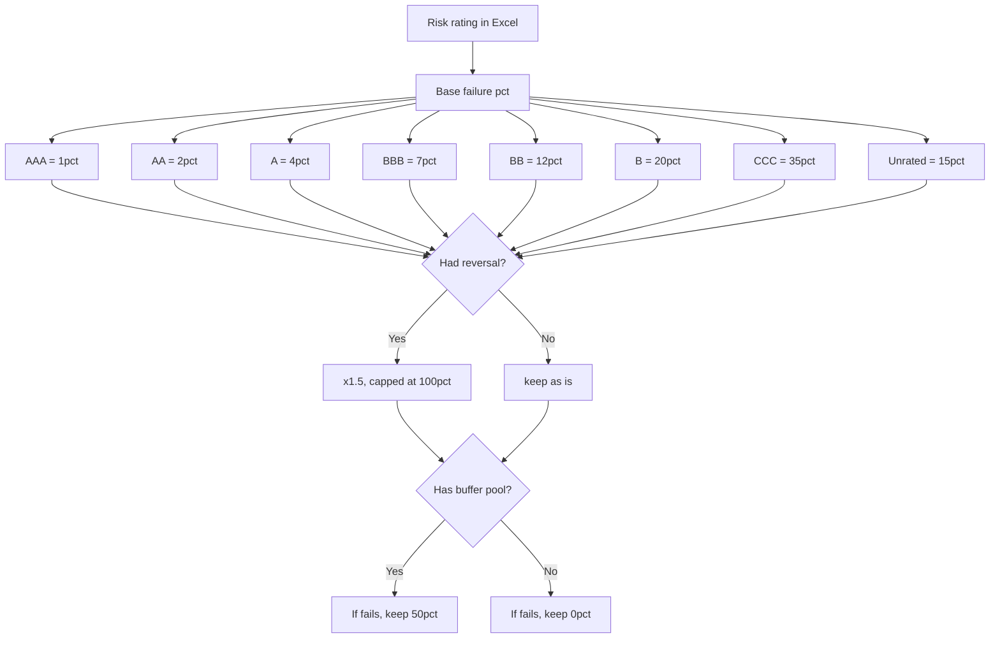
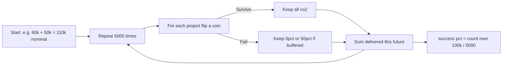
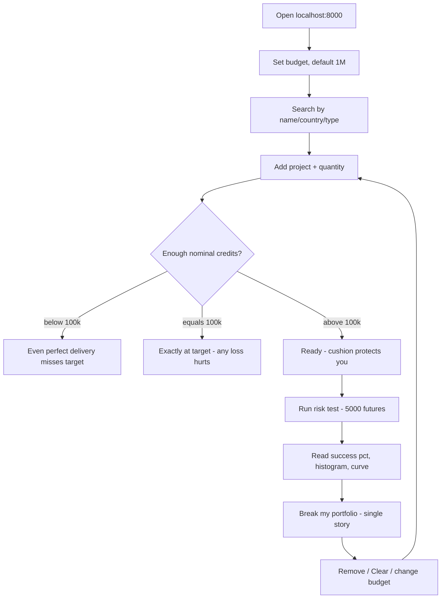

# Carbon Frontier - Understand Carbon-Credit Risk in Simple Terms

> **One-line idea:** You have **$1,000,000** to buy carbon credits and you must
> **deliver 100,000 tCO2e**. Projects can fail. Carbon Frontier lets you build a
> portfolio and test it against **5,000 possible futures** before spending real money.

> NOTE: Prices and risk ratings are **synthetic challenge data** - not market
> forecasts, not verified climate impact. The model is intentionally simple.

---

## 1. Goal and Idea - Explained Simply

Imagine buying apples for a big party:

* You need **100,000 apples** (= 100,000 tonnes of CO2e).
* You have **$1,000,000** to spend.
* There are **4,355 apple farms** (projects) with different prices and reliability.
* Some farms sometimes **lose your apples** (project failure / reversal).
* Some farms have an **insurance box** (buffer pool) that gives back half your apples if they fail.

**Carbon Frontier answers:**

> "If I buy from these farms, what are my chances of still having enough
> apples for the party?"

It does NOT pick projects for you (no optimizer). It shows the **risk** of what YOU picked.



What you see in the app:

1. **Allocation donut** - where did your credits come from?
2. **Delivery histogram** - in 5,000 futures, how much did you actually get?
3. **Confidence curve** - if you aimed higher than 100k, how fast does success drop?
4. **Break-my-portfolio** - one random bad-luck story, project by project.

```
count
  ^        #
  |      # # #
  |    # # # # #        TARGET 100,000
  |  # # # # # # # ------+----------
  +----------------------+------+--> delivered tCO2e
                 miss     |   hit
```

---

## 2. Stack - What Is It Built With?

A **Python brain** + a **plain web page**. No React, no database, no build step.



| Layer | Tech | Why? |
|---|---|---|
| UI | index.html + style.css + vanilla app.js (SVG, no library) | Zero install, works once served |
| API | FastAPI + uvicorn | Tiny, validates with pydantic |
| Math | Pure Python simulation.py (random, statistics) | Easy to read and test |
| Data | openpyxl reads carbon_credits_challenge.xlsx | Challenge source of truth |
| Tests | pytest + httpx | Checks math + API |

```
Ada-Hack/
|-- README.md               <- you are here (big picture)
|-- carbon-alpha/
    |-- main.py             <- server + workbook + validation
    |-- simulation.py       <- simulate_portfolio() + stress_once()
    |-- index.html / app.js / style.css <- UI
    |-- carbon_credits_challenge.xlsx   <- USED (4355 synthetic rows)
    |-- optiver.xlsx        <- PRESERVED raw Berkeley DB (not used)

---

## 3. How Everything Works - Step by Step

### 3.1 The Big Picture



**Golden rule:** the browser only sends {id, co2}. The backend looks up the
REAL price and risk from Excel. You cannot cheat by editing prices in dev-tools.

### 3.2 From Excel Rating to Failure Chance

This is the only magic in the project:



Example:

```
Project: Forestry in India, Rating BB (12%), reversal=yes, buffer=yes

failure_probability = 12% x 1.5 = 18%
if it fails in a simulation -> delivered = co2 x 0.5
if it survives              -> delivered = co2 x 1.0
```

Simplified on purpose: failures are **independent** (coin flip per project).
Real world has correlated risks (same country/developer fails together) - this
model does NOT capture that.


### 3.3 The Monte Carlo Simulation (the heart)

simulate_portfolio() in simulation.py is about 15 lines. In words:



Pseudo-code:

```python
for _ in range(5000):
    delivered = sum(
        p["co2"] if random.random() >= p["failure_probability"]
        else p["co2"] * p.get("loss_recovery_fraction", 0)
        for p in projects
    )
    results.append(delivered)

success = sum(d >= 100000 for d in results) / 5000
```

stress_once() does the SAME thing but once, and remembers WHICH project
survived so the UI can draw per-project bars.

### 3.4 API Contract (3 endpoints only)

| Endpoint | What it does | Request | Response |
|---|---|---|---|
| GET /api/projects | Give catalogue to browser | - | {projects, target:100000, maximum_budget:1000000, source} |
| POST /api/risk | Run 5,000 simulations | {projects:[{id, co2}], budget, target, n_simulations} | {success_probability, shortfall_probability, expected_co2, median_co2, simulation_results} |
| POST /api/stress | One random nightmare | Same shape (count ignored) | {projects:[{id, survived, delivered_co2}], total_delivered, target_reached} |

Validation on every call:

* 1-100 projects, no duplicates, IDs must exist
* co2 > 0 and <= available_tonnes
* cost = sum(co2 x workbook_price) <= budget <= $1M
* target is locked to 100000

### 3.5 User Journey in the UI



    |-- requirements.txt    <- fastapi, uvicorn, openpyxl, pytest, httpx
    |-- test_simulation.py  <- tests
```

---

## 4. Run It Yourself (2 minutes)

```powershell
cd carbon-alpha
python -m pip install -r requirements.txt
python main.py
# open http://127.0.0.1:8000 - keep terminal running, Ctrl+C to stop
```

Do NOT open index.html directly or with Live Server - the page needs the
Python API on the same address.

Try this:

1. Click **Load example portfolio** (3 real workbook rows that fit your budget).
2. Click **Run risk test**.
3. Click **Break my portfolio**.

Run tests:

```powershell
python -m pytest -q carbon-alpha/test_simulation.py
```

---

## 5. Limitations - What This Is NOT

* NOT a market forecast, not investment advice, not verified climate impact.
* NOT an optimizer - it never picks projects for you.
* NOT correlated risk - assumes independent coin flips per project.
* Buffer = always 50%, reversal = always x1.5 - fixed simplifications.

If the app/API is down, do not guess - say what could not be calculated.

---

## 6. Where to Look in Code

* Risk math -> carbon-alpha/simulation.py -> simulate_portfolio(), stress_once()
* Workbook -> API -> carbon-alpha/main.py -> load_projects(), checked_portfolio()
* UI + charts -> carbon-alpha/app.js (window.CarbonFrontierPortfolioRisk) + index.html
* Deep docs + reusable AI prompt -> carbon-alpha/README.md

Dataset: [Optiver challenge sheet](https://docs.google.com/spreadsheets/d/1d3YKqXgVyYUkYA9aYVlmE6ryc5MrrasY/edit) - check Berkeley's licence before redistributing data outside the event.


